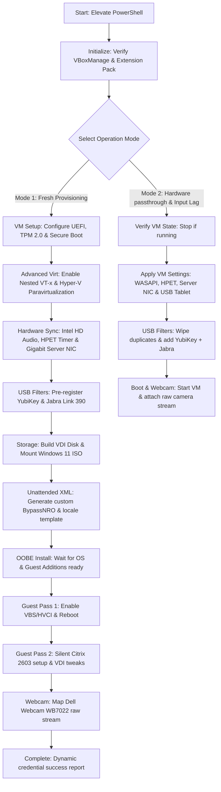

# VirtualBox Windows 11 Citrix VDI Provisioner 🚀

[](https://www.virtualbox.org/)
[](https://www.microsoft.com/software-download/windows11)
[](https://github.com/PowerShell/PowerShell)
[](https://www.citrix.com/)

A completely **unified, 100% self-contained single-script master orchestrator** (`New-VBoxWin11VM.ps1`) designed to deploy, optimize, and secure an ultra-premium, high-performance Windows 11 Pro virtual machine in **Oracle VirtualBox 7.2.8** for local and remote corporate Citrix VDI workflows.

This repository eliminates multiple scattered templates, manual XML manipulations, and post-installation input lag adjustment utilities by combining everything into one cohesive automated pipeline.

---

## 📖 Table of Contents
1. [Architecture & Features](#-architecture--features)
2. [Operating Modes](#-operating-modes)
3. [Prerequisites](#-prerequisites)
4. [Quick Start Guide](#-quick-start-guide)
5. [Low-Latency Optimization Layer](#-low-latency-optimization-layer)
6. [Troubleshooting & Support](#-troubleshooting--support)

---

## 🛠️ Architecture & Features



### Key Technical Enhancements
*   **Virtualization-Based Security (VBS) & HVCI**: Automatically enables UEFI, virtual TPM 2.0, Secure Boot, and guest-side hypervisor-protected code integrity (HVCI) for robust enterprise security compliance.
*   **HPET Audio Stabilization (`--x86-hpet on`)**: Replaces unstable software timers with a hardware **High Precision Event Timer**, completely eliminating audio stuttering, audio dropouts, and video sync drift under heavy Citrix calls.
*   **Low-Latency WASAPI Audio Drivers**: Bypasses legacy DirectSound, linking VirtualBox audio threads directly to Windows WASAPI to achieve sub-millisecond audio capture and playback latency.
*   **Intel Gigabit Server NIC (`82545EM`)**: Replaces desktop network cards with a server-grade controller featuring larger buffer queues to prevent network disconnects and frame drops during resource-heavy corporate VDI streaming.
*   **High Host Scheduling Priority (`--vm-process-priority high`)**: Permanently locks VirtualBox threads to **High** on the host, preventing background host processes from starving the VM of CPU resources.
*   **Raw 1:1 Guest Mouse Emulation (`--mouse usbtablet`)**: Disables OS-level mouse acceleration and absolute scaling anomalies inside the guest VM, establishing raw 1:1 pointer mapping.
*   **Extension Pack Autopilot**: Scans the host system, downloads the matching `7.2.8` Extension Pack, and installs it elevated using silent license agreements to enable USB 3.0 (xHCI) and high-fidelity webcam redirection.

---

## 🔄 Operating Modes

The master orchestrator operates in **two distinct modes** selectable via an interactive terminal GUI:

### Mode 1: Fresh VM Provisioner (Option 1)
Builds an optimized, enterprise-tuned Windows 11 Pro virtual machine from scratch:
1.  Generates a custom `custom_unattended.xml` locally to inject the `BypassNRO` registry keys (allowing local-only account setup without a Microsoft Email).
2.  Pre-registers keyboard/mouse drivers and forces a **UK English (`en-GB`) keyboard layout** to eliminate character translation mismatches.
3.  Pre-configures VM resources to **4 CPU Cores**, **8GB RAM**, and **64GB dynamic VDI storage** (overriding VirtualBox's default hanging specs).
4.  Performs a two-pass post-installation setup to inject silent **Citrix Workspace App 2603** (with App Protection active) and maps your Dell Webcam WB7022 natively.

### Mode 2: Hardware passthrough & Input Lag Configurator (Option 2)
Modifies an **already-built, existing VM** to apply premium low-latency tweaks and USB filters without rebuilding the operating system:
*   Enforces WASAPI audio, HPET timer, Gigabit Server NIC, and high host process priority.
*   Clears duplicate filters and establishes persistent USB routing for **YubiKey** and **Jabra Link 390** wireless adapters.
*   Dynamically boots the VM and attaches the Dell Webcam WB7022 raw stream (`16384` transfer size, `30` FPS).

---

## 📋 Prerequisites

To deploy this solution, ensure your host computer meets these requirements:
*   **Host OS**: Windows 10 or Windows 11 (64-bit).
*   **Hypervisor**: Oracle VirtualBox 7.2.8 (installed, with `VBoxManage.exe` in system PATH or standard default directory).
*   **PowerShell**: Version 5.1 or Core 7+, run as **Administrator**.
*   **Windows 11 ISO**: Placed at `C:\VMDeploy\Win11.iso` (the script auto-detects this; if missing, it opens an interactive Windows Explorer file picker).
*   **Peripherals (Optional)**:
    *   *Dell Webcam WB7022*
    *   *YubiKey OTP+FIDO* smartcard key
    *   *Jabra Link 390 Bluetooth Adapter*

---

## 🚀 Quick Start Guide

### Step 1: Clone the Repository
Open a terminal and clone the deployment files to your workspace:
```bash
git clone https://github.com/cyarwood80/VB_Citrix.git
cd VB_Citrix
```

### Step 2: Elevate PowerShell Execution Policy
Launch a **PowerShell terminal as Administrator** on your host and bypass execution restrictions for the current process session:
```powershell
Set-ExecutionPolicy Bypass -Scope Process
```

### Step 3: Execute the Master Orchestrator
Run the consolidated script directly:
```powershell
& ".\New-VBoxWin11VM.ps1"
```

### Step 4: Follow the UEFI Keypress Boot Alert (CRITICAL UX STEP)
If running **Mode 1 (Fresh VM)**, the script will show a bright green alert screen and pause:
1.  Press `Enter` to continue.
2.  The VirtualBox VM window will open within 1-2 seconds.
3.  **Immediately click inside the VM window and repeatedly tap the Spacebar** to trigger the UEFI CD/DVD boot prompt.
4.  *Why?* If no key is pressed within 5 seconds, UEFI fails to boot the ISO and drops to a terminal prompt. (If this happens, close the VM and restart the script).

---

## ⚡ Low-Latency Optimization Layer

To finalize input responsiveness on an existing VM, navigate inside your running Guest OS and execute the extracted standalone optimizer script:

1.  Locate `Optimize-GuestInputLag.ps1` in your cloned repository folder.
2.  Copy this script file and paste it directly into your Windows 11 Guest VM.
3.  Open **PowerShell as an Administrator** inside the guest VM and run:
    ```powershell
    Set-ExecutionPolicy Bypass -Scope Process
    & ".\Optimize-GuestInputLag.ps1"
    ```
4.  **Log out and log back into your guest user account** (or reboot) to activate:
    *   **Raw 1:1 Mouse Cursor**: Fully disables pointer acceleration (`MouseSpeed=0`).
    *   **Instant UI Transitions**: Sets `MenuShowDelay` to `0` ms and `MouseHoverTime` to `8` ms.
    *   **Snappy Keyboard**: Boosts `KeyboardSpeed` to `31` and drops `KeyboardDelay` to `0`.
    *   **Process Latency Bypass**: Configures HKLM multimedia profiles to grant 100% CPU priority to interactive user processes.

---

## 🔍 Troubleshooting & Support

### Webcam Redirection Error (`0xA00F4244 <NoCamerasAreAttached>`)
*   **Root Cause**: VirtualBox webcam passthrough relies on a proprietary capture device driver inside the VirtualBox Extension Pack. If missing, webcam redirection fails silently in the guest OS.
*   **Resolution**: Execute `New-VBoxWin11VM.ps1` in **Option 2 (Hardware Configurator)**. The script autodetects this, downloads the matching `7.2.8` Extension Pack, and installs it elevated automatically!

### Jittery Audio or Crackling Sounds in Citrix Calls
*   **Root Cause**: Desktop audio emulations (`dsound`) run at very high processing latency, causing sound packets to crackle or drop under CPU load.
*   **Resolution**: The script upgrades the VM to host WASAPI (`was`) and enables HPET (`--x86-hpet on`).
*   **Pro Tip**: For Microsoft Teams calls inside the VM, select the passed-through raw physical USB adapter (**Jabra Link 390**) directly in Teams audio settings. This completely bypasses virtual sound emulations, sending clean audio packets directly to your headset!

### Keyboard Typing Incorrect Characters (Mismatched Layout)
*   **Root Cause**: Clean Windows 11 builds default to a US English layout.
*   **Resolution**: Our script strictly enforces UK English (`en-GB`) layout registry settings globally. If characters are mismatched, ensure your guest language bar shows **ENG (UK)** active.

---

## 📄 License
This project is licensed under the MIT License. See the [LICENSE](LICENSE) file for details.
