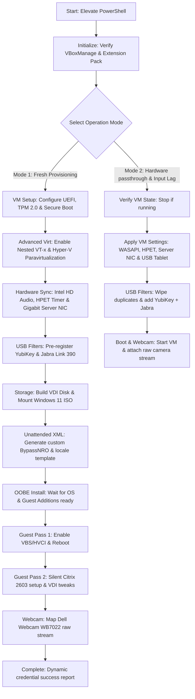

# Runbook: Unified VirtualBox Windows 11 Citrix VDI Provisioner
## A Single-Script Master Solution for Automated Win11 Pro VM Creation, Passthrough & Latency Optimization

This runbook describes the architecture, dual-mode usage, post-install tweaks, and troubleshooting protocols for the master orchestrator script: **`New-VBoxWin11VM.ps1`**.

---

## 1. System & Architecture Overview

The **`New-VBoxWin11VM.ps1`** script is a completely self-contained, consolidated master orchestrator designed for Oracle VirtualBox 7.2.8. It operates in **two distinct modes**, allowing you to either provision a premium, highly optimized Windows 11 Pro virtual machine from scratch, or configure hardware passthrough and input lag tweaks on an existing VM.



### Advanced Hardware & Latency Layer Integrations:
1.  **Low-Latency Sound Emulation**:
    *   **WASAPI Driver (`--audio-driver was`)**: Bypasses legacy DirectSound to communicate directly with the host WASAPI driver.
    *   **Intel HD Audio Controller (`--audio-controller hda`)**: Configures matching speaker and mic codecs.
    *   **High Precision Event Timer (`--x86-hpet on`)**: Replaces unstable software timers with stable hardware ticks to completely prevent audio crackling and video sync drift under CPU-heavy streaming.
2.  **Server NIC Emulation (`--nic-type1 82545EM`)**:
    *   Replaces the desktop adapter with a server-grade Intel PRO/1000 MT adapter containing larger packet buffer queues, preventing Citrix network drops.
3.  **High Process Priority (`--vm-process-priority high`)**:
    *   Locks VirtualBox thread scheduling to **High** on the host, preventing CPU starvation from background host programs.
4.  **Raw Input Emulation**:
    *   **Absolute Pointer (`--mouse usbtablet`)**: Enables absolute coordinate reporting.
    *   **High-Speed Keyboard (`--keyboard usb`)**: Activates low-interrupt keyboard coordination.
5.  **Extension Pack Autopilot**:
    *   Autodetects missing VirtualBox extension packs, fetches matching `7.2.8` components, and runs elevated installs with license signature auto-agreements to enable high-speed USB 3.0 (xHCI) and stable webcam redirection.

---

## 2. Requirements & Prerequisites

To run this script successfully, ensure your host computer meets the following:
*   **Operating System**: Windows 10 or Windows 11 (64-bit).
*   **Hypervisor**: Oracle VirtualBox 7.2.8 (with `VBoxManage.exe` registered in path or standard location).
*   **PowerShell**: Version 5.1 or Core 7+, run with **Administrator (Elevated)** privileges.
*   **Windows 11 Pro ISO**: Placed at `C:\VMDeploy\Win11.iso` (the script auto-detects this; if not found, it opens an interactive explorer dialog to choose your ISO file).
*   **Hardware Accessories (Optional)**:
    *   *Dell Webcam WB7022* (plugged into USB).
    *   *YubiKey OTP+FIDO* smartcard.
    *   *Jabra Link 390 Bluetooth Adapter* (plugged into USB).

---

## 3. How to Run the Script

### Step 1: Elevate Execution Policy
Open a **PowerShell terminal as Administrator** and authorize execution in the current process:
```powershell
Set-ExecutionPolicy Bypass -Scope Process
```

### Step 2: Launch the Master Orchestrator
Execute the master script directly from the workspace folder:
```powershell
& "C:\Users\chris\.gemini\antigravity\scratch\VBoxWin11Provisioner\New-VBoxWin11VM.ps1"
```

### Step 3: Choose Operation Mode
The console wizard will load a colored banner and request your choice:

```
======================================================================
      VIRTUALBOX WINDOWS 11 PRO CITRIX VDI CLIENT PROVISIONER         
        Consolidated 1-Script Solution for Ultimate VDI Speed         
======================================================================

 ➔ Locating VirtualBox installation...
 ✔ Found VirtualBox Manage Tool: C:\Program Files\Oracle\VirtualBox\VBoxManage.exe
 ✔ VirtualBox Version: 7.2.8
 ➔ Checking for VirtualBox Extension Pack...
 ✔ VirtualBox Extension Pack is already installed.

--- STEP 1: SELECT OPERATION MODE ---

  [1] Fresh VM Provisioner (Deploy a brand new Windows 11 VM from scratch)
  [2] Hardware Configurator (Optimize passthrough & input lag on an existing VM)

 Select Option [1]: 
```

---

## 4. Detailed Execution Runbooks

### RUNBOOK A: Fresh VM Provisioner (Option 1)

This mode guides you through building a clean, enterprise-tuned Windows 11 Pro VDI client.

1.  **Input Parameters**:
    *   Specify the **VM Name** (Default: `Win11-Citrix-VDI`).
    *   Specify your company's **Citrix Storefront discovery URL** (Default: `https://citrix.company.com/Citrix/Store/discovery`).
    *   Specify the **Administrator account name** (Default: `VDIAdmin`).
    *   A **strong complex password** is auto-generated for you (e.g., `J2f9a7!gDk1mB9A1!a`). **Write this down immediately!** It is required to log in post-install.
2.  **Start Provisioning**:
    *   Confirm parameters and press `Enter`. The script deletes any old VM or lingering media in the VirtualBox registry, creates a **64GB VDI**, mounts the ISO, and prepares the unattended parameters.
3.  **The UEFI Keypress Boot Warning (CRITICAL UX STEP)**:
    *   The script will pause at a bright green alert screen and wait for you to press `Enter`.
    *   **Action**: Press `Enter` to start the VM. Within 1-2 seconds, the VirtualBox window will open. **Immediately click inside the VM window and repeatedly tap the Spacebar** (or any key) to trigger the CD/DVD boot prompt.
    *   *Why?* If no key is pressed within 5 seconds, UEFI fails to boot the ISO and drops to the UEFI command shell. (If this happens, close the VM window and restart the provisioning script).
4.  **Offline Local Account Auto-Setup**:
    *   Our customized `custom_unattended.xml` automatically injects `BypassNRO` and disables UAC + first logon animations.
    *   *Helper Tool*: If Windows setup hangs on the Microsoft login screen during OOBE, press **`Shift + F10`** in the guest VM and type `C:\Bypass-OOBE.cmd` followed by `Enter`. This forces the local-only creation wizard.
5.  **Post-Install Two-Pass Guest setup**:
    *   **Pass 1**: The script monitors Guest Additions, writes the Guest Setup script, enables `VirtualMachinePlatform` / `HypervisorPlatform` inside the VM, configures VBS/HVCI security, and triggers a guest reboot.
    *   **Pass 2**: Bootstraps the VM, silently installs **Citrix Workspace App 2603** via `winget` (with App Protection enabled), sets up the VDI Store, and adjusts latency parameters.
6.  **Webcam Mapping**: Maps your Dell Webcam natively to device index `.1`.

---

### RUNBOOK B: Hardware Passthrough & Input Lag Configurator (Option 2)

This mode applies all hardware passthrough, Extension Pack updates, and webcam parameters to an **already-built VM**, or helps you correct inputs on a laggy VM.

1.  **Input Parameters**:
    *   Specify the **VM Name** (Default: `Win11-Citrix-VDI`).
2.  **State Verification**:
    *   The script checks if the VM is running. If it is active, it requests permission to send a graceful ACPI shutdown signal. Once the VM reaches `poweroff` status, modifications proceed.
3.  **Hardware Tuning**:
    *   Exposes high-speed USB 3.0 (xHCI), server-grade NIC (`82545EM`), high host process scheduling priority, WASAPI driver integration, absolute mouse pointer coordinates (`usbtablet`), USB keyboard, and HPET hardware clock timer.
4.  **USB Accessory Routing**:
    *   Clears duplicate filters and adds persistent filters for YubiKey and Jabra Link 390.
5.  **Dynamic Webcam redial**:
    *   Boots the VM and automatically attaches your Dell Webcam natively to index `.1` at a high-speed `16384` byte transfer rate and `30` FPS.

---

## 5. Eliminating Guest Input Lag Inside the VM

To finalize eliminating input lag on an existing VM (or complete the optimization overlay applied in Runbook B), run the standalone Guest Responsiveness script inside your guest Windows 11 system:

1.  **Transfer the Script**:
    *   On your host computer, navigate to:
        `C:\Users\chris\.gemini\antigravity\scratch\VBoxWin11Provisioner\Optimize-GuestInputLag.ps1`
    *   Copy the file or its raw code contents.
    *   Paste it directly inside your Windows 11 Guest VM.
2.  **Execute as Administrator**:
    *   In the guest VM, open **PowerShell as an Administrator**.
    *   Execute the script:
        ```powershell
        Set-ExecutionPolicy Bypass -Scope Process
        & "C:\Path\To\Optimize-GuestInputLag.ps1"
        ```
3.  **Restart session**:
    *   Let the script configure your mouse, keyboard repeat delayer, hover latency keys, and global Default User NTUSER hive optimizations.
    *   **Log off and log back into your guest Windows account** (or reboot) for changes to take full effect.

---

## 5.5 Host-Side Memory Optimization

Because running nested virtualization with 3D graphics on a Windows host naturally commands high memory footprints (shadow page tables and disk caching), we have created a dedicated host-side tuning utility: **`Optimize-VBoxHostMemory.ps1`**.

You can run this directly on your Windows host as an Administrator to:
1.  **Trim Active RAM Footprint (Live & Safe)**: Uses Windows API page compression to immediately release unused memory cache in running `VirtualBoxVM` processes, reclaiming several gigabytes of host RAM instantly.
2.  **Apply Low-Memory hardware configurations**:
    *   *Balanced Profile*: Disables host-side disk caching and caps VRAM at `128MB` (adequate for single displays).
    *   *Aggressive Profile*: Disables disk caching, sets VRAM to `128MB`, and **disables Nested Virtualization (`--nested-hw-virt off`)**. Disabling VT-x passthrough removes the massive shadow address tables, saving **6GB to 10GB** of host memory! *(Only select if you do not run Docker/WSL2 inside the guest VM).*

### How to Run:
In your elevated **host PowerShell terminal**, execute:
```powershell
Set-ExecutionPolicy Bypass -Scope Process
& "C:\Users\chris\.gemini\antigravity\scratch\VBoxWin11Provisioner\Optimize-VBoxHostMemory.ps1"
```

---

## 6. Troubleshooting Protocols

### Webcam Redirection Error (`0xA00F4244 <NoCamerasAreAttached>`)
*   **Root Cause**: VirtualBox webcam redirection relies on a proprietary capture device driver inside the VirtualBox Extension Pack. If the Extension Pack is missing or mismatched, the camera fails to materialize inside the Windows Guest.
*   **Resolution**: Run `New-VBoxWin11VM.ps1` in **Option 2 (Hardware Configurator)**. The script will automatically verify, download, and install the matching Extension Pack for you silently.

### Jittery Audio or Crackling Sounds in Citrix Calls
*   **Root Cause**: Desktop audio virtualization drivers (`dsound`) have high processing latency, causing sound packets to be delayed under high CPU loads.
*   **Resolution**: The script upgrades the VM to modern host WASAPI (`was`) and enables HPET (`--x86-hpet on`).
*   **Pro Tip for VDI Teams Calls**: Select the passed-through raw physical USB adapter (**Jabra Link 390**) directly in Teams audio settings. This completely bypasses virtual sound emulations, sending clean audio packets directly to your headset!

### Keyboard Typing Incorrect Characters (Mismatched Layout)
*   **Root Cause**: Windows 11 defaults to US English layouts on clean builds, which translates characters incorrectly if you type on a UK physical keyboard.
*   **Resolution**: The unattended template and our guest script strictly enforce UK layouts (`en-GB`) and strip away standard US mappings. If issues persist, verify that your guest language bar shows **ENG (UK)** active.
